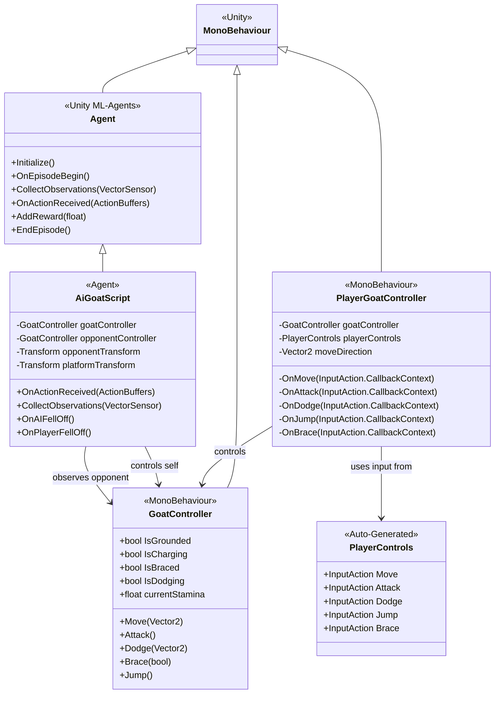
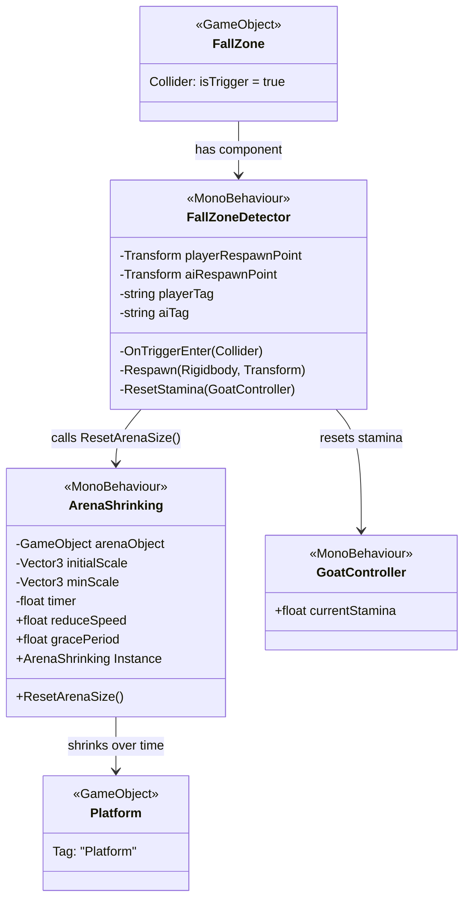
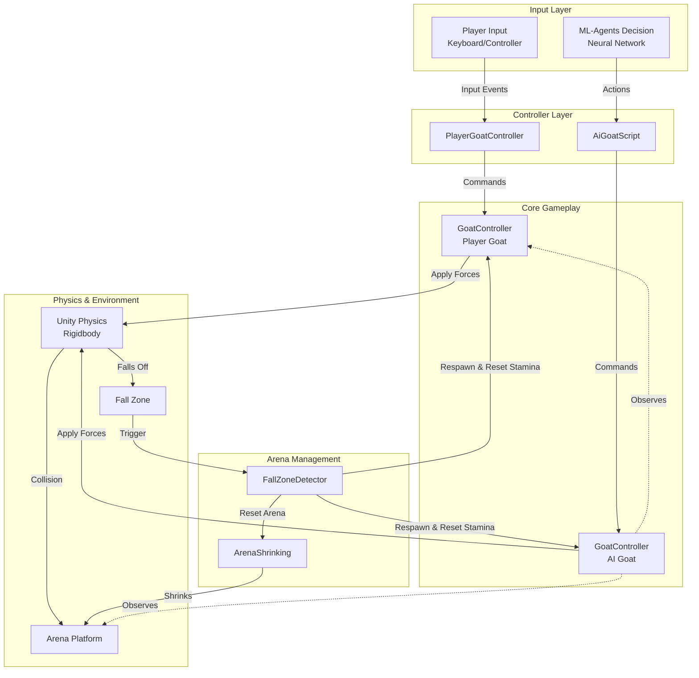

# Bumper Goats - UML Class Diagrams

This document contains 3 focused UML class diagrams for the Bumper Goats Unity project.

---

## Diagram 1: Controller System (Player & ML-Agent)

This diagram shows how the player controller and AI controller both use the core `GoatController` component.

### Key Points:

- **GoatController** is the shared core component that handles all goat actions (move, attack, dodge, jump, brace)
- **PlayerGoatController** translates Unity Input System events into GoatController commands
- **AiGoatScript** uses ML-Agents to control the goat via reinforcement learning
- Both controllers use the same GoatController interface, ensuring consistent behavior

---

## Diagram 2: Arena Management System

This diagram shows how the arena shrinking and fall zone detection work together.

### How It Works:

**Arena Shrinking:**

1. `ArenaShrinking` is a singleton that runs continuously
2. After a grace period (10 seconds), it gradually reduces the platform scale
3. The arena shrinks from `initialScale` down to `minScale`
4. Can be reset via `ResetArenaSize()`

**Fall Zone Detection:**

1. `FallZoneDetector` has a trigger collider below the arena
2. When a goat falls through and enters the trigger:
   - The goat is respawned at its spawn point
   - The goat's stamina is reset to full
   - The arena size is reset via `ArenaShrinking.Instance.ResetArenaSize()`

**Interconnection:**

- These systems are loosely coupled but work together
- FallZoneDetector triggers arena reset when any goat falls
- Both systems operate independently but coordinate through the singleton pattern

---

## Diagram 3: System Interaction Flow

This diagram shows how all major systems interact during gameplay.

### System Flow:

1. **Input → Controller**: Human input or AI decisions reach their respective controllers
2. **Controller → GoatController**: Both controllers send commands to their GoatController instance
3. **GoatController → Physics**: Actions apply forces to Rigidbody components
4. **Physics → Environment**: Goats interact with the platform and can fall off
5. **Fall Detection**: When a goat enters the fall zone trigger, FallZoneDetector handles respawn
6. **Arena Reset**: After a fall, the arena size is reset and the cycle continues

---

## Summary

### Diagram 1 - Controller System

Shows the **dual control scheme**: human players use input system → PlayerGoatController → GoatController, while AI uses ML-Agents → AiGoatScript → GoatController.

### Diagram 2 - Arena Management

Shows the **environment systems**: ArenaShrinking progressively shrinks the platform, and FallZoneDetector handles respawns and resets when goats fall.

### Diagram 3 - System Interaction

Shows the **complete gameplay loop**: from input to physics to environment management and back.
